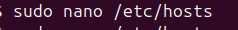
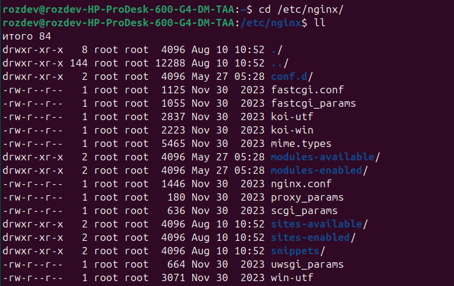

# Nginx with Self-Signed SSL Configuration Guide

## 1. Setting Up Local Development Environment

### Configuring Local DNS with Hosts File

#### Viewing Current Hosts File

Displaying the current contents of the system's hosts file.

#### Adding Local Domains to Hosts File

Adding local domain entries to the hosts file for local development.

## 2. Creating Nginx Configuration Files

Using `nano` to create and edit Nginx configuration files in the sites-available directory.

## 3. Checking Nginx Installation and Status

Verifying Nginx service status with `systemctl status nginx` command. The service is active (running) with master process PID 7140.

## 2. Accessing Nginx Configuration Directory

Listing contents of the main Nginx configuration directory at `/etc/nginx/` showing all available configuration files and directories.

## 3. Testing Nginx with curl

Using `curl localhost` to test the default Nginx welcome page.

## 4. Viewing Default Page in Browser

Default Nginx welcome page displayed in a web browser, confirming successful installation.

## 5. Configuring Virtual Hosts

### Site 1 Configuration

Creating the first virtual host configuration file for site1 in the `/etc/nginx/sites-available/` directory.

### Site 2 Configuration

Configuring the second virtual host (site2) similar to site1 with the following adjustments:
- Different server name (site2.local)
- Separate document root directory

## 6. Verifying Nginx Configuration

Running `nginx -t` to test the Nginx configuration files for correct syntax.

## 7. Creating Website Content

Creating and editing the main `index.html` file for the website content.

## 8. Viewing Website Results

### Site 1 Result

Successfully loaded site1 with the custom content in the web browser.

### Site 2 Result

Successfully loaded site2 with the custom content in the web browser.

## 9. Implementing Basic Authentication

### Installing Apache2 Utilities

Installing Apache2 utilities package to access the `htpasswd` tool for creating password files.

### Creating Authentication Password

Using `htpasswd` command to create a password file for HTTP basic authentication.

### Updating Site 1 Configuration with Authentication

Modifying the site1 Nginx configuration to enable HTTP basic authentication.

### Testing Authentication in Browser

Browser displaying the authentication dialog when accessing the protected site.

### Verifying Password File

Displaying the contents of the created password file with the hashed credentials.

## 10. Setting Up SSL with Self-Signed Certificate

### Generating SSL Certificate

Using OpenSSL to generate a self-signed SSL certificate for secure HTTPS connections.

### Configuring SSL Certificate

Setting up the SSL certificate and private key paths in the Nginx configuration.

### Updating Site 2 with SSL

Modifying site2 configuration to enable HTTPS with the generated SSL certificate.

### Verifying SSL in Browser

Browser security warning for the self-signed certificate, which is expected behavior.

## 12. Monitoring Nginx Processes

Viewing all running Nginx processes

## 13. Applying Configuration Changes

Using `systemctl reload nginx` to apply configuration changes without downtime.

## 15. Configuring HTTP to HTTPS Redirect

Configuring Nginx to automatically redirect HTTP traffic to HTTPS for secure connections.
